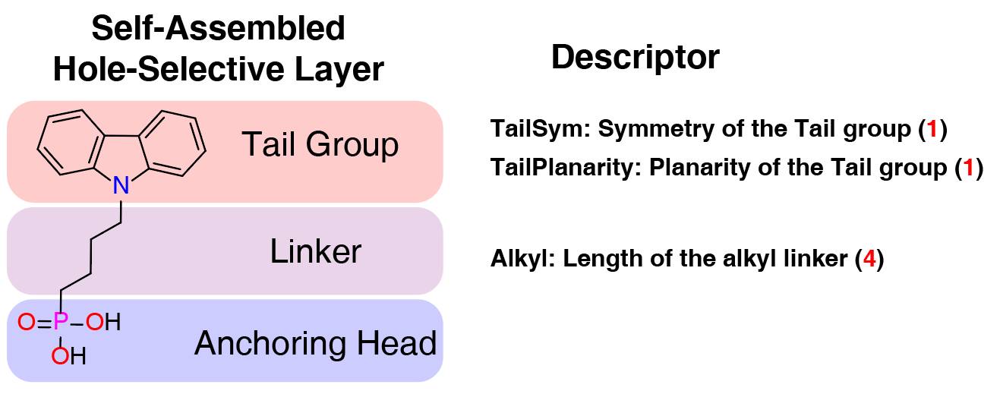

# Perovskite HTL Prediction — Pairwise Ranking via D-MPNN

This repository contains the code for the paper "[Semi-rigid hole-selective self-assembled monolayers for inverted perovskite solar cells](https://doi.org/)". The code is written in Python and uses the chemprop library for deep learning. This work implements a perovskite hole transport layer (HTL) performance prediction and ranking system based on chemprop v2 D-MPNN molecular encoding + pairwise ranking loss (Margin Ranking + Delta Regression).



## Project Structure

```
.
├── htl_ranking.py              # Main entry point (CLI)
├── htl_package/                # Core package
│   ├── __init__.py             # Package entry point, unified exports
│   ├── constants.py            # Global constants, logging, device configuration
│   ├── configs.py              # Dataclass configurations (Model/Training/Finetune/Predict/Surrogate)
│   ├── features.py             # Feature extraction (extra/global features)
│   ├── datasets.py             # Dataset classes (Pair/List/CachedPair/Surrogate)
│   ├── models.py               # Neural network models (D-MPNN Encoder, HTLRankingModel, Loss, EarlyStopping)
│   ├── checkpoint.py           # Model checkpoint save/load (safetensors format)
│   ├── training.py             # Training and fine-tuning logic
│   ├── prediction.py           # Inference prediction (pairwise/list/unreliable analysis)
│   ├── explainer.py            # Explainability (Integrated Gradients, differential attribution)
│   └── visualization.py        # Visualization tools (molecular heatmaps, feature bar charts, score rankings)
├── tests/                      # Unit tests
│   ├── conftest.py             # Test configuration (chemprop mock)
│   ├── test_constants.py       # Constants tests
│   ├── test_configs.py         # Configuration class tests
│   ├── test_features.py        # Feature extraction tests
│   ├── test_models.py          # Model and loss function tests
│   ├── test_checkpoint.py      # Checkpoint save/load tests
│   ├── test_training.py        # Training utility function tests
│   └── test_visualization.py   # Visualization tool tests
├── htl-data-combinations.csv   # Training data (pairwise format)
├── htl-new.csv                 # Prediction data (pairwise format)
└── ranking-new.csv             # Ranking data (single-molecule format)
```

## Usage

### Training

```bash
# Random split training
python htl_ranking.py --mode train --csv htl-data-combinations.csv

# Group split by DOI
python htl_ranking.py --mode train --csv htl-data-combinations.csv --split group

# Group split + Leave-One-Group-Out cross-validation (top-5 largest DOI groups)
python htl_ranking.py --mode train --csv htl-data-combinations.csv --split group --n_cv_folds 5
```

### Fine-tuning

```bash
python htl_ranking.py --mode finetune --csv htl-data-combinations.csv \
    --checkpoint_dir checkpoints --checkpoint_name best_model \
    --finetune_epochs 10 --finetune_lr 1e-5
```

### Pairwise Prediction

```bash
python htl_ranking.py --mode predict \
    --predict_csv htl-new.csv \
    --checkpoint_dir checkpoints --checkpoint_name final_model
```

### List Ranking

```bash
python htl_ranking.py --mode list_rank \
    --predict_csv ranking-new.csv \
    --checkpoint_dir checkpoints --checkpoint_name final_model \
    --output ranked_results.csv
```

### Explainability Analysis

```bash
# Single-molecule IG attribution
python htl_ranking.py --mode explain \
    --explain_csv ranking-new.csv \
    --checkpoint_dir checkpoints --checkpoint_name final_model \
    --explain_dir explain_output --n_steps 50

# Differential attribution (molecule pairs)
python htl_ranking.py --mode diff_attr \
    --diff_csv htl-new.csv \
    --checkpoint_dir checkpoints --checkpoint_name final_model \
    --diff_dir diff_output --n_steps 100
```

## Key Parameters

| Parameter             | Description                                                                   | Default                   |
| --------------------- | ----------------------------------------------------------------------------- | ------------------------- |
| `--mode`              | Running mode: train / predict / finetune / list\_rank / explain /  diff\_attr | train                     |
| `--csv`               | Training data path                                                            | htl-data-combinations.csv |
| `--epochs`            | Number of training epochs                                                     | 1000                      |
| `--batch_size`        | Batch size                                                                    | 32                        |
| `--hidden_size`       | D-MPNN hidden dimension                                                       | 300                       |
| `--depth`             | D-MPNN message passing layers                                                 | 6                         |
| `--dropout`           | Dropout rate                                                                  | 0.1                       |
| `--lr`                | Learning rate                                                                 | 5e-4                      |
| `--margin`            | Margin for Margin Ranking Loss                                                | 0.2                       |
| `--patience`          | Early stopping patience                                                       | 50                        |
| `--early_stop_warmup` | Early stopping warmup epochs                                                  | 20                        |
| `--split`             | Data split strategy: random / group                                           | random                    |
| `--n_cv_folds`        | LOGO CV folds (group split only)                                              | None                      |
| `--seed`              | Random seed                                                                   | 42                        |

## Model Architecture

```
SMILES ──► D-MPNN ──► mol_emb [H]
                              ├─ cat ──► FFN ──► [score_PCE]
extra_features [E] ──────────┤
global_features [G] ─────────┘
```

- **D-MPNN Encoder**: Based on chemprop v2 BondMessagePassing, supports mean/sum/norm aggregation
- **Siamese Network**: Two HTL materials share parameters
- **Ranking Loss**: α · Margin Ranking Loss + β · Delta Regression Loss

## Data Format

### Pairwise Training Data (htl-data-combinations.csv)

| Column                     | Description                                         |
| -------------------------- | --------------------------------------------------- |
| `doi`                      | Literature source identifier                        |
| `MO_ITO`                   | Global feature (ITO substrate)                      |
| `SMILES_1` / `SMILES_2`    | SMILES of the two HTL materials                     |
| `Alkyl_1` / `Alkyl_2` etc. | Additional molecular features (with \_1/\_2 suffix) |
| `PCE_1` / `PCE_2`          | Power conversion efficiency (target variable)       |

### Single-Molecule List Data (ranking-new\.csv)

| Column       | Description                               |
| ------------ | ----------------------------------------- |
| `Materials`  | Material name                             |
| `SMILES`     | SMILES string                             |
| `Alkyl` etc. | Additional molecular features (no suffix) |
| `MO_ITO`     | Global feature                            |

